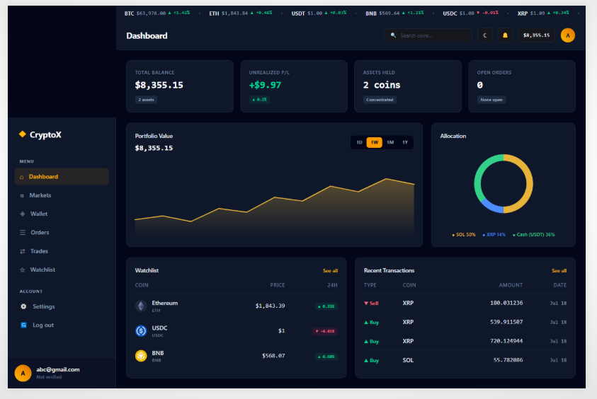
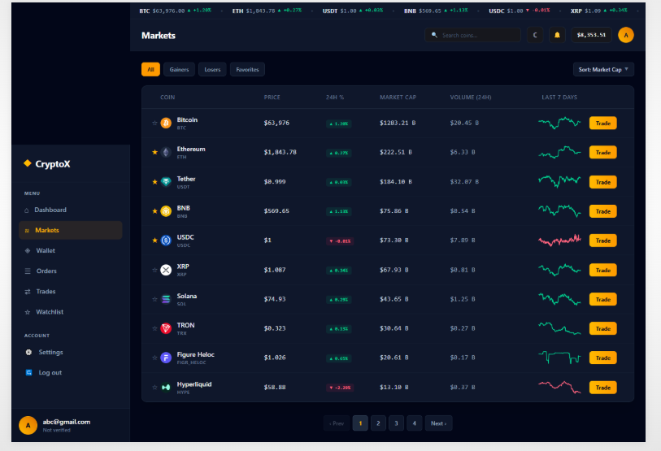
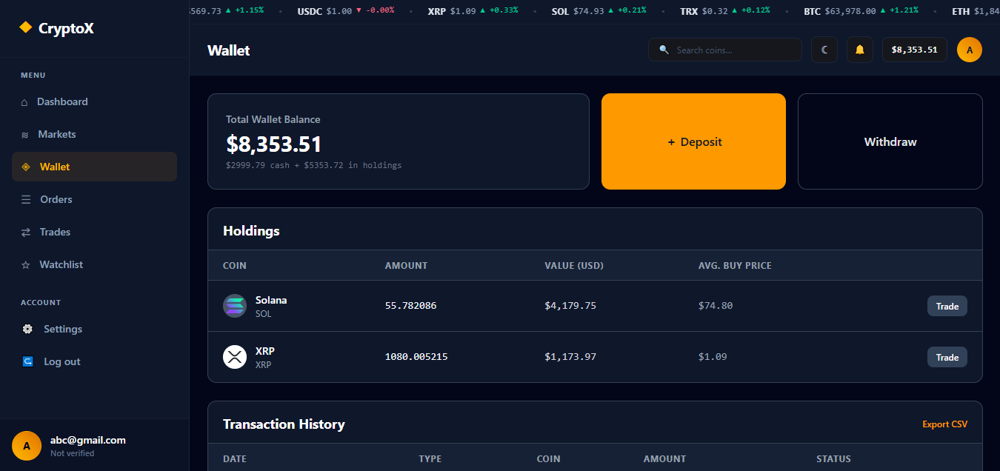
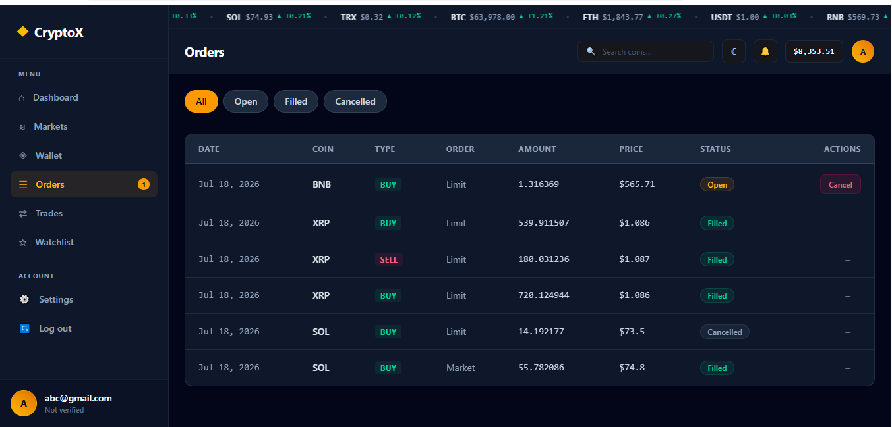

# 🚀 Crypto Trading Platform

A modern cryptocurrency trading dashboard built with **React.js**, **Redux Toolkit**, and **Tailwind CSS**.
This project provides real-time crypto market data, watchlist management, and a responsive trading dashboard experience.

## 🌟 Features

* 🔐 Authentication UI (Login / Logout)
* 📊 Crypto market dashboard
* 🪙 Live cryptocurrency data using CoinGecko API
* 📈 Market listing with:

  * All coins
  * Gainers
  * Losers
  * Favorites
* ⭐ Add / Remove coins from watchlist
* 🔄 Global state management using Redux Toolkit
* ⚡ Async API handling using createAsyncThunk
* 🔎 Coin details and trading navigation
* 📱 Fully responsive UI
* 🌙 Modern dashboard design

## 🛠️ Tech Stack

### Frontend

* React.js
* Vite
* JavaScript (ES6+)
* Tailwind CSS
* React Router DOM
* Redux Toolkit
* React Redux
* Axios
* Lucide React Icons

### API

* CoinGecko API

### Tools

* Git & GitHub
* VS Code
* npm

## 📂 Project Structure

```
src
│
├── api
│   └── axiosInstance.js
│
├── app
│   └── store.js
│
├── features
│   ├── auth
│   │   └── authSlice.js
│   │
│   ├── crypto
│   │   └── cryptoSlice.js
│   │
│   └── watchlist
│       └── watchlistSlice.js
│
├── components
│
├── pages
│
└── routes
```

## ⚙️ Installation & Setup

Clone the repository:

```bash
git clone https://github.com/your-username/trading-platform-client.git
```

Go inside the project:

```bash
cd trading-platform-client
```

Install dependencies:

```bash
npm install
```

Create `.env` file:

```env
VITE_COINGECKO_API_KEY=your_api_key
```

Run development server:

```bash
npm run dev
```

## 🏗️ Build for Production

Create production build:

```bash
npm run build
```

Preview build:

```bash
npm run preview
```

## 🚀 Deployment

This project can be deployed on:

* Netlify
* Vercel
* AWS Amplify

## 📸 Screenshots






## 🔮 Future Improvements

* User authentication with backend
* Node.js + Express API
* MongoDB database integration
* Real trading simulation
* Portfolio management
* Price charts
* Payment subscription system

## 👨‍💻 Author

**Mohd Farman**

Frontend Developer
React.js | Redux Toolkit | MERN Stack
